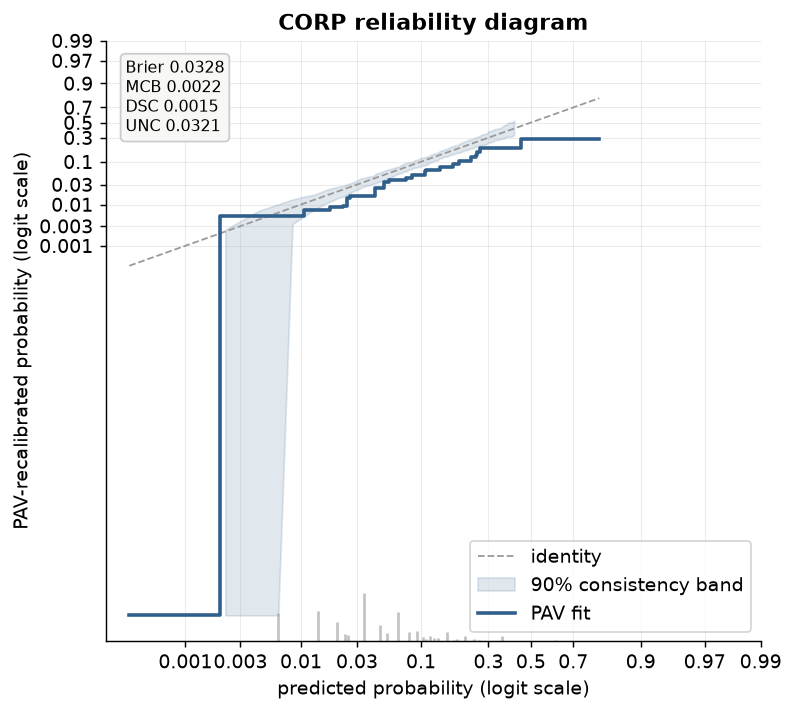
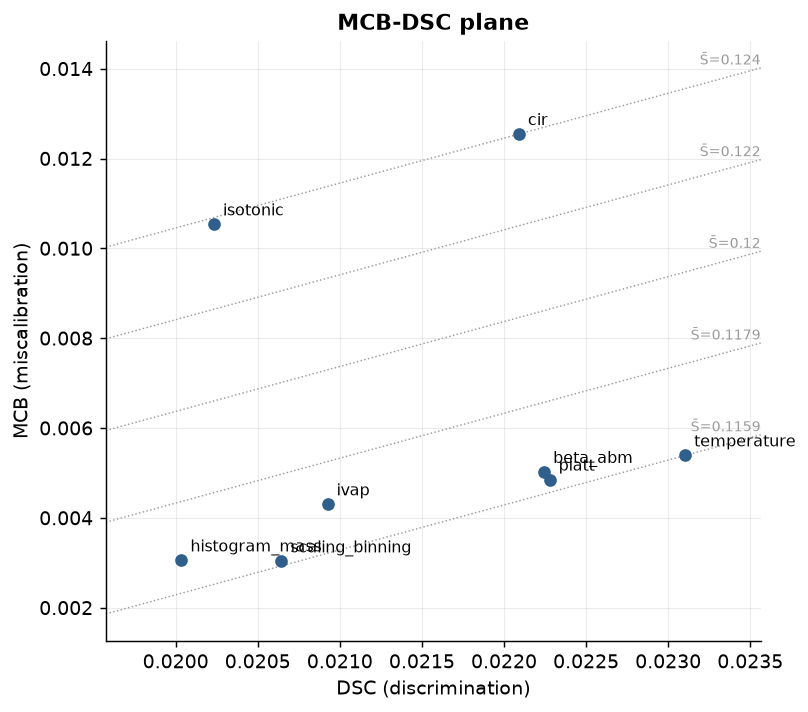

# CORP and score decomposition

**CORP** — consistent, optimally binned, reproducible — is the reliability diagram of
Dimitriadis, Gneiting and Jordan (2021): the isotonic (pool-adjacent-violators, PAV)
recalibration map of `y` on `p`, and nothing else. It is *consistent* because a
miscalibrated forecaster cannot make the diagram look better than it is; *optimally
binned* because the block structure comes from the data (PAV) rather than a bin-count
choice a validator has to defend; and *reproducible* because two people with the same
`(y, p)` get the exact same step function, with no smoothing bandwidth or bin-edge
convention to disagree about. `probcal.curves.corp_reliability` computes it,
`probcal.plots.plot_corp` draws it, and both stand alongside the binned and smooth
reliability constructions described in [Visualization](visualization.md) rather than
replacing them — CORP is the discretization-free option when the diagram itself, not just
a bandwidth-tuned overlay, needs to be defensible.

## The PAV fit

`corp_reliability(y, p, bands="consistency")` sorts `p`, pools tied scores
(`isotonic._aggregate_ties`), and runs weighted PAVA (`_math.pava`) on the pooled
event rate: this is ordinary least-squares isotonic regression, `min sum w_i (y_i -
m_i)^2` subject to `m` non-decreasing, solved in amortized O(n) by the standard
pool-and-merge sweep — no partition search, no cross-validated bin count. The result is a
step function: each PAV block covers a `[block_lo, block_hi]` range of `p` at one fitted
level `block_level`, with `block_weight` giving each block's pooled sample weight.
`plot_corp` draws that step against the identity, with grey ticks below the axis sized by
each block's weight share so a reader can see which parts of the fit rest on how much data.



## The MCB-DSC-UNC decomposition

Every proper score decomposes into three terms — CORP computes this decomposition for
both the Brier score and log loss, since the same PAV fit drives both:

- **UNC** (uncertainty): the score of the constant forecast `p = ybar`, the ceiling
  a forecaster cannot do worse than if all it knows is the base rate.
- **DSC** (discrimination): how much the PAV fit improves on that constant forecast —
  the resolution the recalibrated predictions actually carry.
- **MCB** (miscalibration): how much the raw score falls short of the PAV fit's score —
  the part of the raw score attributable purely to being poorly calibrated, since the PAV
  fit is by construction calibrated on this sample.

They satisfy `score == mcb - dsc + unc` **exactly**, to floating-point precision, by
construction (`_corp.decompose` computes all three from the same three mean-score
evaluations — at `p`, at the PAV fit, and at the constant `ybar` — so the identity is
algebraic, not approximate). `plot_corp(show_decomposition=True)` (the default) prints all
four numbers — score, MCB, DSC, UNC — in a stats box on the diagram itself.

Two numeric conventions apply throughout:

- **Log-loss clip `1e-12`.** A PAV block can land at an exact event rate of 0 or 1 (a
  block with no events, or all events), which makes `log(0)` well-defined mathematically
  but not in floating point. `_corp._CLIP = 1e-12` clips both the raw predictions and the
  PAV levels to `[1e-12, 1 - 1e-12]` before taking logarithms — the same clip used
  everywhere else in the package (`_math.logit`'s `_LOGIT_CLIP`) — so log-loss decomposition
  stays finite at degenerate blocks instead of raising or returning `inf`.
- **Weighted PAVA.** Sample weights are pooled through both stages: tied scores are
  aggregated first (`isotonic._aggregate_ties`, weight-summing duplicate `p` values into
  one point with a weighted mean `y`), then `_math.pava` runs its weighted merge sweep on
  the aggregated points. An unweighted call is exactly the `w = 1` special case — there is
  no separate unweighted code path to drift out of sync.

## Bands: pointwise, not uniform

`corp_reliability(bands=...)` resamples the fit to put an uncertainty band around the PAV
step, in two flavors:

- **`"consistency"`** (the default) resamples `y_b ~ Bernoulli(p)` under the null that `p`
  is already calibrated — "if this forecaster were perfectly calibrated, how much would
  its PAV fit wobble by chance alone?" This is the band to read against the *identity*: it
  answers whether the observed deviation from the diagonal could be resampling noise under
  perfect calibration.
- **`"confidence"`** instead bootstraps `(y, p, sample_weight)` triples with replacement —
  "given this data, how much would the PAV fit wobble under resampling?" This is the band
  to read against the *fit itself*: it answers how precisely the fitted curve is pinned
  down, independent of whether it happens to sit on the diagonal.

Both bands are built the same way (`_corp.corp_bands`): resample `n_resamples` times, refit
PAV on a shared 201-point grid spanning the 0.5th to 99.5th percentile of `p`
(`_corp.eval_step` evaluates the step fit at arbitrary grid points), and take the pointwise
central `level` quantile interval across resamples at each grid point independently.

That last clause is the reason coverage is stated **pointwise, not uniform**: at any one
grid point, a nominal 90% band contains the true fit's value roughly 90% of the time across
repeated experiments. It does *not* follow that the whole curve stays inside its band 90%
of the time — with 201 (correlated, but not perfectly correlated) grid points, the chance
that at least one of them strays outside a 90%-pointwise band on a given draw is
substantially higher than 10%. A validator reading "the fit exits the band somewhere in the
tail" should not conclude "reject calibration at the 90% level" from a pointwise band the
way a simultaneous (uniform) band would license — that is a materially stronger claim this
construction does not make. `docs/scripts/corp_sim.py` quantifies the gap directly by
drawing repeated consistency-band experiments and checking, per draw, both whether the
*average* grid point (pointwise) and whether *every* grid point (uniform) landed inside;
the table below reports both.

## The MCB-DSC plane and selector columns

A single number per candidate — Brier, or log loss — hides *why* one calibrator beats
another: it could discriminate better, or simply be better calibrated, or trade one for the
other. `plot_mcb_dsc` plots each candidate at `(DSC, MCB)` instead, with dashed iso-score
diagonals `MCB = DSC + (S̄ - UNC)` traced for five score values spanning the candidates'
range — candidates on the same diagonal tie on the aggregate score despite sitting at
different points of the discrimination/miscalibration trade-off. Lower-right is strictly
better: the same or more discrimination for the same or less miscalibration.



`plot_mcb_dsc` accepts either a `{name: (y, p)}` mapping — each entry's CORP decomposition
is computed fresh, and every entry's `y` must share the same weighted mean so that UNC (and
therefore the diagonals) is comparable across candidates — or, directly, a fitted
`CalibratorSelector`'s `report_`. As of probcal 0.3, `SelectionReport` carries `mcb`, `dsc`,
and `unc` columns alongside the existing `score_mean`/`score_sd`/`guardrails_ok`: one
`corp_fit`/`decompose` call per candidate on its own out-of-fold predictions, decomposing
Brier when the selection criterion is Brier and log loss otherwise (matching whichever
score actually drove the ranking). A report loaded from before 0.3 (e.g. an old golden)
has `mcb=dsc=unc=None`, and `plot_mcb_dsc` raises rather than plotting a plane with columns
that were never computed.

## Coverage simulation

`tests/test_corp_sim.py` (`pytest.mark.slow`) enforces **pointwise coverage >= 0.85** at
level 0.9 in CI, at a reduced size (`n=1000`, 60 runs, 100 resamples per band) to stay fast
enough for the ordinary test suite. The table below is the full-size version — 500 runs per
cell, both problem sizes and both nominal levels the package advertises — produced by
`docs/scripts/corp_sim.py` and pasted here verbatim:

| n | level | pointwise coverage | uniform coverage | gate |
|---|-------|---------------------|-------------------|------|
| 1000 | 0.8 | 0.7954 | 0.0000 | pointwise >= 0.75 |
| 1000 | 0.9 | 0.8899 | 0.0100 | pointwise >= 0.85 |
| 5000 | 0.8 | 0.7915 | 0.0000 | pointwise >= 0.75 |
| 5000 | 0.9 | 0.8873 | 0.0040 | pointwise >= 0.85 |

Pointwise coverage tracks its nominal level closely at both sample sizes and both levels
(0.7954/0.8899 at `n=1000`, 0.7915/0.8873 at `n=5000`, against nominal 0.8/0.9): at any one
grid point, the band contains the true PAV fit about as often as advertised. Uniform
coverage — the fraction of the 500 runs where *every one* of the 201 grid points landed
inside its band simultaneously — is near zero at every cell (0.0000/0.0100 at `n=1000`,
0.0000/0.0040 at `n=5000`): with 201 correlated-but-not-identical grid points, the chance
that at least one of them strays outside a 90%-pointwise band on a given draw is far higher
than 10%, so a run essentially always has at least one excursion somewhere along the curve.
This is the gap the *Bands* section above predicts, and it is the reason the package's
guarantee, the CI gate, and this table all state coverage pointwise: the shaded ribbon in
`plot_corp` is a pointwise envelope, not a simultaneous one, and a reader who needs "the
whole curve stays inside its band `level` of the time" should not read the ribbon as
answering that question — nothing in this release does.

## In probcal

```python
from probcal import make_pd_portfolio
from probcal.curves import corp_reliability
from probcal.plots import plot_corp, plot_mcb_dsc
from probcal.selection import CalibratorSelector

port = make_pd_portfolio(n=5000, random_state=0)
y, p = port.y, port.scores

result = corp_reliability(y, p, bands="consistency", level=0.9)
print(result.brier, result.brier_mcb, result.brier_dsc, result.brier_unc)
ax = plot_corp(result, scale="logit")

sel = CalibratorSelector(cv=4, random_state=42).fit(p, y)
ax = plot_mcb_dsc(sel.report_)                       # mcb/dsc/unc columns, probcal >= 0.3
ax = plot_mcb_dsc({"raw": (y, p), "recalibrated": (y, sel.predict_proba(p))})
```

## References

- Dimitriadis, T., Gneiting, T., Jordan, A. I. (2021). "Stable reliability diagrams for
  probabilistic classifiers." *Proceedings of the National Academy of Sciences* 118(8),
  e2016191118.
