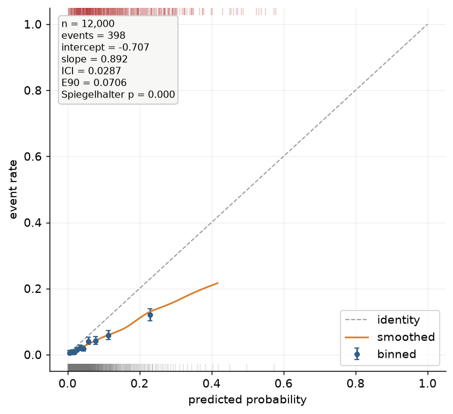
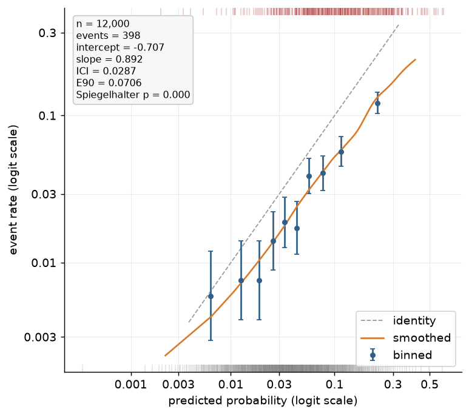
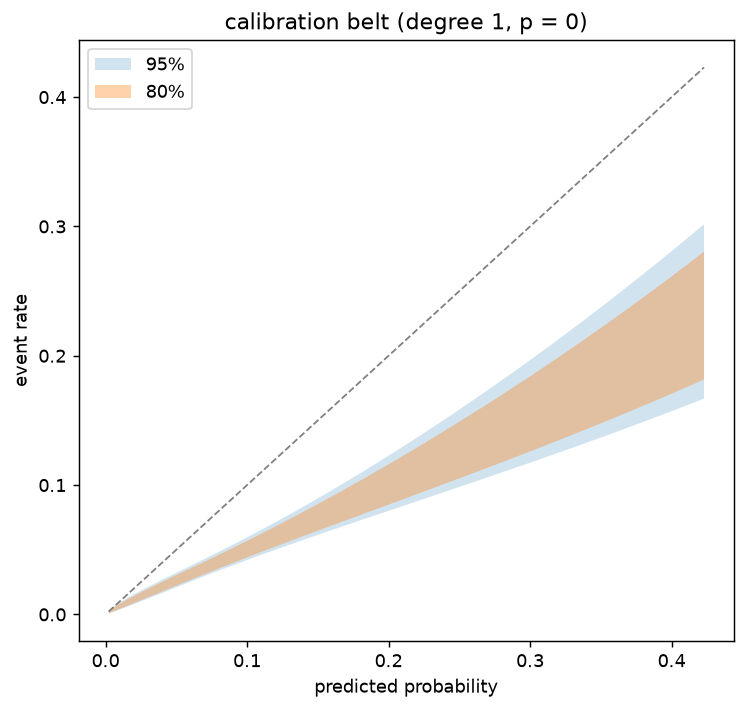
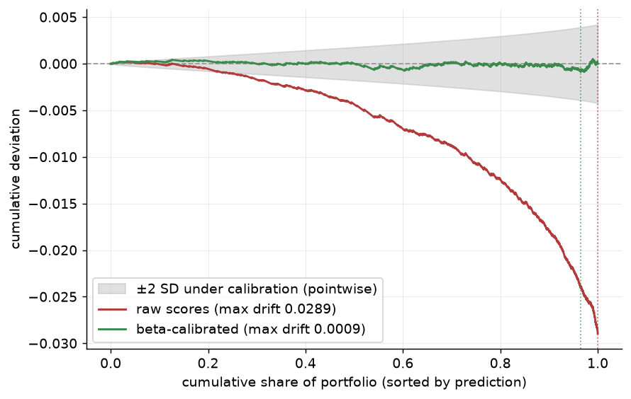
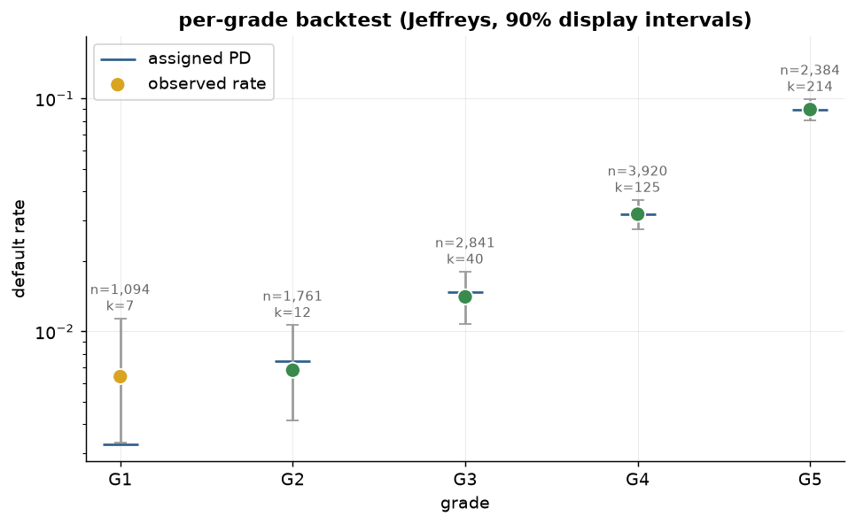
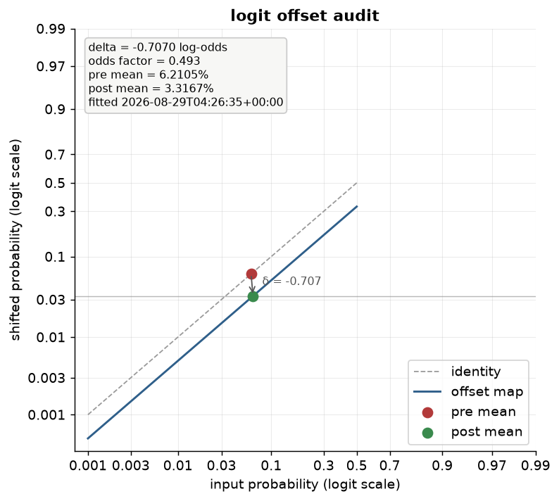
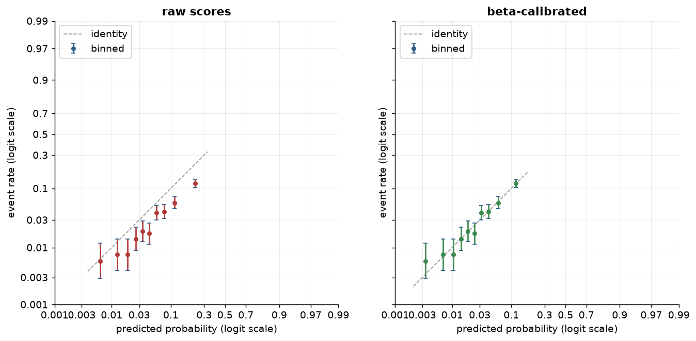
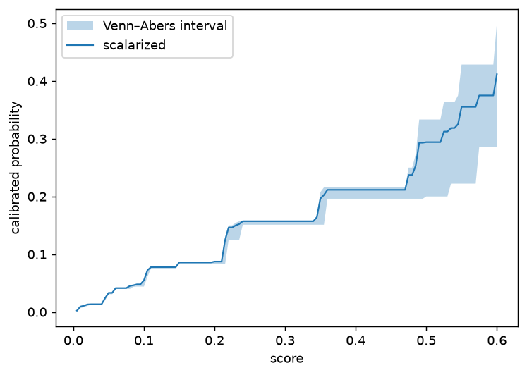
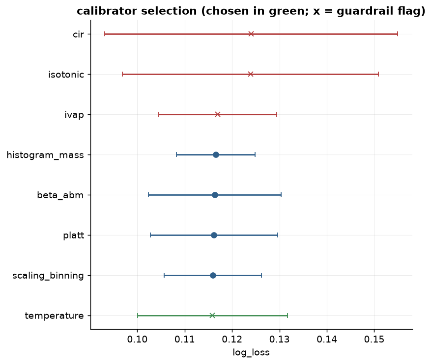

# Visualization

Every calibration claim in this package has a picture, and the pictures are built in two
layers: `probcal.curves` computes plotting-ready dataclasses with numpy alone, and
`probcal.plots` renders them when matplotlib (the `[viz]` extra) is installed. The
separation means every curve is available to any backend — or to no backend, in a batch
report — and the rendering layer adds convention, not computation.

## Reliability constructions

The reliability diagram plots estimated event rate against predicted probability; a
calibrated model traces the diagonal. probcal builds it four ways, because the
construction *is* the estimator and inherits its trade-offs. `reliability_binned` groups
predictions (equal-mass by default), plotting each bin's mean prediction against its event
rate with a **Wilson confidence interval** — the binomial interval that behaves sensibly at
the small counts and extreme rates a PD portfolio produces. Data density is shown by the
per-class rug along the axis edges (a count-bar margin remains available via
`counts=True`), so sparse regions announce themselves. `reliability_loess` and
`reliability_spline` draw the smooth versions in the tradition of Austin and Steyerberg
(2014), trading the binning artifacts for a bandwidth choice; plotted together with the
binned points they distinguish real curvature from bin noise. Every curve object carries
both probability-scale and logit-scale coordinate arrays, so the choice of scale is made at
plot time, not at computation time.

`reliability_smooth` (`KernelReliabilityCurve`) is the fourth construction, and the only
one whose bandwidth is not a free choice: it reuses `metrics.smooth_ece`'s fixed-point
bandwidth `sigma_star` — the same equal-width logit lattice and the same truncated
Gaussian kernel — so `curve.smooth_ece` reproduces the metric exactly rather than merely
tracking it, and the diagram and the number it is read against always agree. Because
`sigma_star` is tuned for the smECE aggregate rather than for a low-variance curve, the
pointwise estimate is noisier than `reliability_loess`'s wide, fraction-of-data bandwidth
and needs a larger sample before it settles; its confidence ribbon (a seeded bootstrap of
`(y, p, sample_weight)` triples, `n_boot=0` to disable) is computed at that one fixed
`sigma_star`, so it reads as uncertainty in the rate given the bandwidth, not uncertainty
in the bandwidth choice itself.

## Why the logit scale is the flagship

On a low-PD portfolio, the probability-scale reliability diagram is a picture of almost
nothing: the entire book lives between 0 and 0.1, the region a linear axis compresses into
its left margin.



The same data on the logit scale, where the miscalibration becomes readable:



Plotting on the logit scale stretches exactly where the decisions are —
the difference between 0.5% and 1% PD is a factor of two in price and a full grade on a
masterscale, and it is invisible on \( [0,1] \) but a fixed distance in log-odds.
`plot_reliability(scale="logit")` is therefore the package's default recommendation for
credit work, with axis ticks *labeled in probabilities* at logit positions, so the reader
keeps probability intuition while the geometry keeps resolution. Parametric calibrators are
straight lines on this scale (slope and intercept readable by eye), the
[offset](offset.md) is a vertical translation, and tail miscalibration — the kind that
costs money at the approval cutoff — stops hiding in the corner.

## The annotated reliability diagram

Passing the raw `y`/`p` to `plot_reliability` upgrades the diagram in the `rms::val.prob`
tradition: the picture carries its own numbers. The stats box — computed by
`probcal.metrics.reliability_summary`, never inside the plotting layer — reports the sample
size and event count, the [calibration intercept and slope](metrics.md) (level and spread of
the miscalibration in log-odds), ICI and E90 (typical and near-worst absolute distance to
the smoothed curve, in probability units), and Spiegelhalter's p-value (the classical
unbiasedness test). One glance answers the three questions a validator asks of a
reliability diagram: how much data, how wrong, and is it statistically distinguishable from
calibrated. The rug along the axis edges marks events (top) and non-events (bottom),
deterministically thinned to at most 1000 marks per class — sorted, evenly strided, no RNG
anywhere in plotting — so two renders of the same data are always identical. All probcal
plots style themselves through a per-call `rc_context`; your global matplotlib
configuration is never touched.

## The calibration belt

A smoothed reliability curve without uncertainty invites overinterpretation. The **GiViTI
calibration belt** (Nattino, Finazzi and Bertolini, 2014) answers with a confidence region:
fit a polynomial logistic recalibration of the outcome on \( \operatorname{logit}(p) \),
selecting the polynomial degree by forward likelihood-ratio testing (capped at degree 4),
then invert the likelihood-ratio acceptance region pointwise into a band around the fitted
curve at the requested confidence levels (80% and 95% by default). Where the band excludes
the diagonal, the data affirmatively reject calibration in that region — a localized,
test-backed statement no eyeballed curve provides — and the associated p-value summarizes
the global test. The construction (Nattino et al., 2017, describe the practitioner-facing
version) is reimplemented in probcal from the papers, on the numpy-only χ² machinery of
`probcal._math`.



## The ECCE drift walk

The [ECCE](metrics.md) sorts observations by prediction and accumulates the residuals; the
resulting walk hovers near zero under calibration and drifts under systematic error, and
*where* it drifts localizes the miscalibration along the score range without any binning or
bandwidth choice. `ecce_curve` computes the walk (its `stat_max` agrees exactly with
`metrics.ecce`) and `plot_ecce` renders one or several — raw versus calibrated is the
natural pair. Each curve's maximum drift is quoted in the legend and marked by a dotted
tick at the position where it occurs. The grey envelope is ±2 *pointwise* standard
deviations of the walk under calibration: an honest reading aid, not a simultaneous
confidence band — a walk can exit a pointwise envelope somewhere by chance more often than
the nominal level suggests, and the formal max-statistic test of Arrieta-Ibarra et al.
(2022) is not implemented in this release.



## The per-grade backtest chart

`plot_grade_backtest` turns a [per-grade backtest result](metrics.md) into the chart a
validation committee reads: observed default rates as circles colored by the grade's
traffic light, the assigned PDs as wide dashes underneath, and grey whiskers spanning each
grade's 90% display interval — the central Jeffreys posterior interval or the
Clopper–Pearson interval, matching the test that produced the result. The intervals are
display companions, not the test: the verdict is carried by the lights from the unchanged
one-sided tests, which is why no p-values appear on the canvas. Per-grade `n` and `k`
annotations keep the sample sizes honest, and the log-scale y-axis (the default) keeps a
masterscale spanning two orders of magnitude readable.



## The offset audit chart

`plot_offset_audit` draws a fitted [LogitOffset](offset.md) as what it is: a vertical
translation on the logit scale. The blue offset map runs parallel to the grey identity at
distance \( \delta \); the red and green markers place the pre- and post-adjustment
central tendencies, joined by the annotated shift arrow, with the target mean as a thin
reference line when the offset was fitted in target-mean mode. The stats box reads
everything from the fitted attributes — \( \delta \) in log-odds, the odds factor
\( e^{\delta} \), both means, and the fit timestamp — so the chart audits the *stage*
itself; for the before/after guardrail comparison on outcomes, `audit_report()` remains
the tool.



## The remaining plots

Three further views complete `probcal.plots`. `plot_comparison(before, after)` puts
pre- and post-calibration (or pre- and post-offset) reliability on one axis pair — the
picture a validation report leads with. `plot_interval` draws
[Venn–Abers interval widths](methods-distribution-free.md) against score, localizing where
calibration uncertainty concentrates. `plot_selection` renders the
[SelectionReport](auto-selection.md) as a ranked dot plot with fold-spread whiskers and
guardrail markers — the table, made presentable. All of them accept the dataclasses from
`probcal.curves`, and none of them is importable without the `[viz]` extra; the import
guard raises with the install instruction rather than a bare `ImportError`.







## In probcal

```python
from probcal import calibration_belt, reliability_binned, reliability_loess
from probcal.curves import ecce_curve
from probcal.metrics import jeffreys_grade_test, reliability_summary
from probcal.plots import (  # [viz] extra
    plot_belt, plot_comparison, plot_ecce, plot_grade_backtest,
    plot_offset_audit, plot_reliability,
)

curve = reliability_binned(y, p, n_bins=10)        # Wilson CIs, both scales
smooth = reliability_loess(y, p)
belt = calibration_belt(y, p)
print(belt.degree, belt.p_value)
print(reliability_summary(y, p))                   # the stats-box numbers, standalone

ax = plot_reliability(curve, smooth=smooth, scale="logit", y=y, p=p)   # the flagship view
ax = plot_belt(belt)
fig = plot_comparison(reliability_binned(y, s_raw), reliability_binned(y, p))
ax = plot_ecce([ecce_curve(y, s_raw), ecce_curve(y, p)], labels=["raw", "calibrated"])
ax = plot_grade_backtest(jeffreys_grade_test(y, p, grades))
ax = plot_offset_audit(fitted_offset)              # a fitted LogitOffset stage
```

## References

- Arrieta-Ibarra, I., Gujral, P., Tannen, J., Tygert, M., Xu, C. (2022). "Metrics of Calibration for Probabilistic Predictions." *Journal of Machine Learning Research* 23(351), 1–54.
- Austin, P. C., Steyerberg, E. W. (2014). "Graphical assessment of internal and external calibration of logistic regression models by using loess smoothers." *Statistics in Medicine* 33(3), 517–535.
- Nattino, G., Finazzi, S., Bertolini, G. (2014). "A new calibration test and a reappraisal of the calibration belt for the assessment of prediction models based on dichotomous outcomes." *Statistics in Medicine* 33(14), 2390–2407.
- Nattino, G., Lemeshow, S., Phillips, G., Finazzi, S., Bertolini, G. (2017). "Assessing the Calibration of Dichotomous Outcome Models with the Calibration Belt." *Stata Journal* 17(4), 1003–1014.
