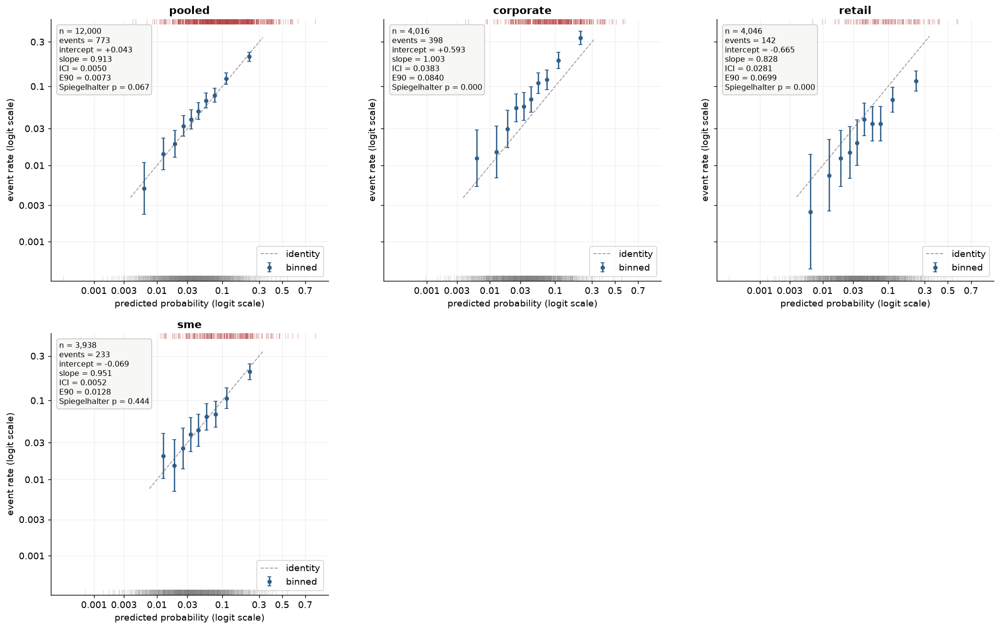

# Grouped evaluation

--8<-- "docs/_snippets/vocab.md"

How-to; the bootstrap protocol itself is documented in the *Metrics and
tests* concepts chapter. This page covers only what `by=` adds on top of
it.

```python
# s_cal, y_cal: held-out calibration scores and outcomes
import numpy as np
from probcal.metrics import evaluate
from probcal.plots import plot_reliability   # probcal[viz]
from probcal.curves import reliability_binned

segment = np.where(s_cal < 0.01, "retail", "corporate")

report = evaluate(y_cal, s_cal, n_boot=100, random_state=42, by=segment)   # 100: fast for the docs harness
report.groups          # display names, sorted, e.g. ("corporate", "retail")
report.pooled          # MetricReport on the full data (random_state unchanged)
report.reports         # one MetricReport per group, aligned with .groups
report.counts          # observation count per group
report.to_frame()      # long-format rows: group, metric, value, ci_low, ci_high

fig = plot_reliability(reliability_binned(y_cal, s_cal), y=y_cal, p=s_cal, by=segment)
```



That is the case for looking: the pooled panel is on the identity, and
the three segments are not. Two offsetting level errors cancel in the
pool, so a portfolio that passes every aggregate guardrail can still be
systematically optimistic for one segment and pessimistic for another.
That is what `by=` is for, and what
[Segmented calibration](../concepts/segmented.md) repairs once you have
seen it.

Each group's report is the same call you would make by hand on that
group's slice: `evaluate(y[mask], scores[mask], random_state=42 + 1000 * i, ...)`,
where `i` is the group's position in sorted display-name order. Results are
identical whether you group with `by=` or slice manually, and deterministic
regardless of how many groups exist or what the labels are. Groups are
formed from the raw label values and displayed as `str(value)`: `1` and
`"1"` are different values, and since they would share the display name
`"1"`, passing both raises `ValueError` instead of silently merging them. A group with
only one outcome class raises the same `ValueError` a direct call on that
slice would, naming the offending group. `plot_reliability(by=...)` draws
the same panels: a pooled panel plus one per group, laid out on shared axes
(`curve` itself is ignored in this mode; each panel rebuilds its own
binned curve from that group's data). Since 0.4.0 every panel follows the
single-panel defaults, stats box and rug included, and `annotate`, `stats`,
`rug`, `risk_dist`, `counts` and `scale` are forwarded to each panel; pass
`annotate=False, rug=False` for the lighter panels of 0.3.x. `ax=` and
`smooth=` cannot be combined with `by=` and raise `ValueError`.

**What this is not.** `by=` reports side by side; it runs no test of
whether groups differ, and applies no multiple-comparison correction
across the group reports it returns. Formal group-conditional calibration
*testing* is future work, not implemented here. Read `report.reports`
descriptively, the way you would read several `evaluate()` calls made by
hand.
