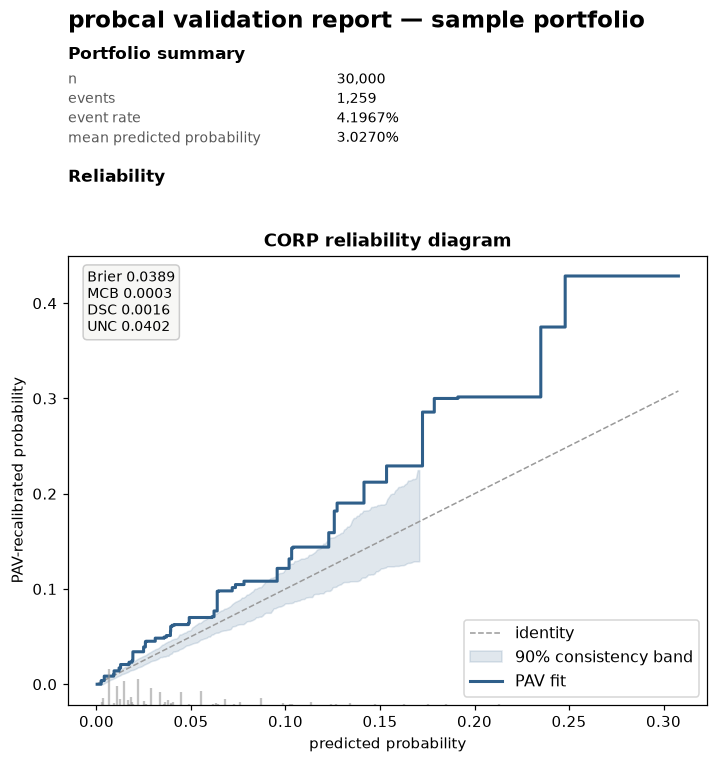

# Validation report

How-to; every number and figure in the validation document comes from the
APIs documented in their own chapters (*Metrics and tests*,
*Visualization*, *CORP and score decomposition*, *Conservatism*,
*Monitoring*) — this page covers only assembling them into one document.

**[Open a full sample report](../assets/sample_validation_report.html)** —
every section switched on, over the twelve-cohort drift scenario the
[monitoring chapter](../concepts/monitoring.md#components) plots. It is a
single self-contained HTML file, so the link is the whole artifact.

[](../assets/sample_validation_report.html)

Regenerate it deliberately, not on every build:
`uv run python docs/scripts/generate_sample_report.py`.

```python
# s_cal, y_cal: held-out calibration scores and outcomes
from probcal import BetaCalibrator
from probcal.report import validation_report   # probcal[viz]

cal = BetaCalibrator().fit(s_cal, y_cal)

html = validation_report(
    y_cal, s_cal,
    calibrator=cal,        # optional: adds the appendix (to_json + interpret())
    monitor=mon,            # optional: adds the e-process trajectory section
    grades=grades,          # optional: adds the Jeffreys/Pluto-Tasche section
    by=segments,            # optional: adds the grouped-evaluation section
    n_boot=50, seed=42,     # one shared knob for every resampling site
                            # (50: reduced for the docs harness; use 200+)
    path="validation.html",
)
```

Sections are omitted, not left blank, when their input is absent:
reliability, the metric report, and the CORP decomposition always appear
(they need only `y`/`scores`); the rating-grades, grouped-evaluation,
monitoring, and appendix sections appear only when `grades`, `by`,
`monitor`, or `calibrator` (respectively) are given. `n_boot`/`seed` are
shared by every resampling site in the document (`metrics.evaluate`,
`curves.corp_reliability`, `curves.reliability_smooth`), so the whole
document is one call, deterministic given the same inputs and `seed`
(byte-identical apart from its single `Generated ... UTC` timestamp line).

`format="html"` (default) embeds every figure as a base64 PNG — the file
is fully self-contained, no external requests, no `<script>`. Emailing it
or dropping it in a model-risk file share needs nothing else.

Every caller-supplied label — group names, grade names, the monitor's
`recommendation`/`alarm_at`/`onset_label` strings, the report `title` — is
HTML-escaped before interpolation (GFM-cell-escaped for `"|"` in
`format="markdown"` tables), so a label containing markup or a table
delimiter renders as literal text, never as injected HTML or a corrupted
table row.

```python
validation_report(
    y_cal, s_cal, grades=grades,
    format="markdown", path="validation.md",
)
```

`format="markdown"` requires `path`: figures are written as PNG files to
`<path stem>_figures/` next to it and referenced with relative GFM image
links, and the tables are GFM tables — the natural format for a PR
description, a wiki page, or a document handed to a generator that does
not render embedded base64 images.

Import cost: `import probcal.report` never pulls in matplotlib, even when
the `[viz]` extra is installed — the module only imports it, lazily, the
first time `validation_report` actually renders a figure. Calling
`validation_report` itself still needs `[viz]`, since it renders at least
one figure from `y`/`scores` alone; without it the call raises
`ImportError` naming the extra.
