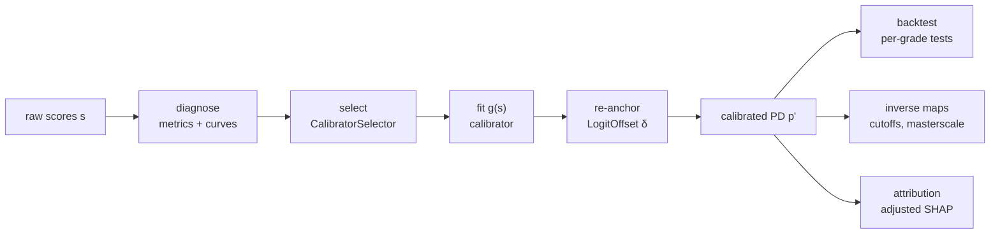

# How it works

probcal treats post-hoc calibration as a pipeline of small, separately auditable stages.
This page walks the pipeline once, end to end, with pointers into the concept chapters
where the mathematics lives.

## 1. Diagnose

Everything starts from scored outcomes \( (s_i, y_i) \). The
[recalibration regression](concepts/metrics.md) fits
\( \operatorname{logit}\Pr(Y{=}1) = \alpha + \beta \operatorname{logit}(s) \): the pair
\( (\alpha, \beta) \) against \( (0, 1) \) localizes the defect (level vs spread), the
[reliability curve](concepts/visualization.md) — best read on the logit scale for low-PD
work — shows its shape, and the guardrail triplet condenses the verdict. A pure level
error points to the one-parameter offset; a wrong slope points to the parametric
families; visible curvature points to the nonparametric ones.

## 2. Select

`CalibratorSelector` runs an inner cross-validation *within* the calibration data: every
candidate is repeatedly fitted on inner-training folds and scored — by out-of-fold
log loss, a strictly proper score — on inner-validation folds. Ties inside one standard
error break toward fewer parameters. The [selection chapter](concepts/auto-selection.md)
explains why this nesting is structural, not procedural: scoring a calibrator on its own
fitting data systematically crowns the most flexible candidate.

## 3. Fit

The winning map \( g \) is refitted on the full calibration set. Every calibrator
returns an `Interpretation` — fitted parameters plus their domain reading (for beta:
tail sensitivities \( a, b \), base-rate shift \( c \), identity at \( (1,1,0) \)). The
derivations live in the [parametric](concepts/methods-parametric.md),
[nonparametric](concepts/methods-nonparametric.md), and
[distribution-free](concepts/methods-distribution-free.md) chapters.

## 4. Re-anchor

Portfolio-level drift — the credit-risk central tendency — is repaired by
\( p' = \sigma(\operatorname{logit}(p) + \delta) \), a rigid logit shift kept *outside*
the calibrator: `offset_to(target_mean=...)` appends an inspectable `LogitOffset` stage
whose `audit_report()` shows the pre/post guardrails. The
[offset chapter](concepts/offset.md) derives the same \( \delta \) three ways (King–Zeng,
Elkan, Tasche).

## 5. Consume

Three consumers hang off the calibrated output:

**Backtesting.** Per-grade [binomial and Jeffreys tests](concepts/metrics.md) with
traffic lights — the supervisory reporting shape.

**Decision thresholds.** Policies live on calibrated PD; deployed systems cut on raw
scores. `interval_inverse` and the masterscale helper `calibrated_bands_to_raw`
translate one into the other, refusing unattainable targets instead of clamping — see
[Inverse maps](concepts/inverse-maps.md), including the `buffer_logit` margin that makes
translated thresholds robust to the next quarterly re-anchor.

**Reason codes.** Calibration breaks SHAP additivity; `adjust_attributions` restores it
on the calibrated scale — exactly for logit-affine stages, by the Aumann–Shapley rule in
general — with signs and rankings preserved under monotone maps. See
[SHAP and calibration](concepts/shap-calibration.md).

## The two flows

All of the above assumes scores the model has not memorized. `flow="prefit"` uses a
dedicated calibration set (the credit-risk canon); `flow="cv"` synthesizes out-of-fold
scores when data are too scarce to split, pooling them into a single auditable map by
default. The trade-offs — and how large a calibration set has to be, counted in events
per parameter — are the subject of [Data splitting](concepts/data-splitting.md).
